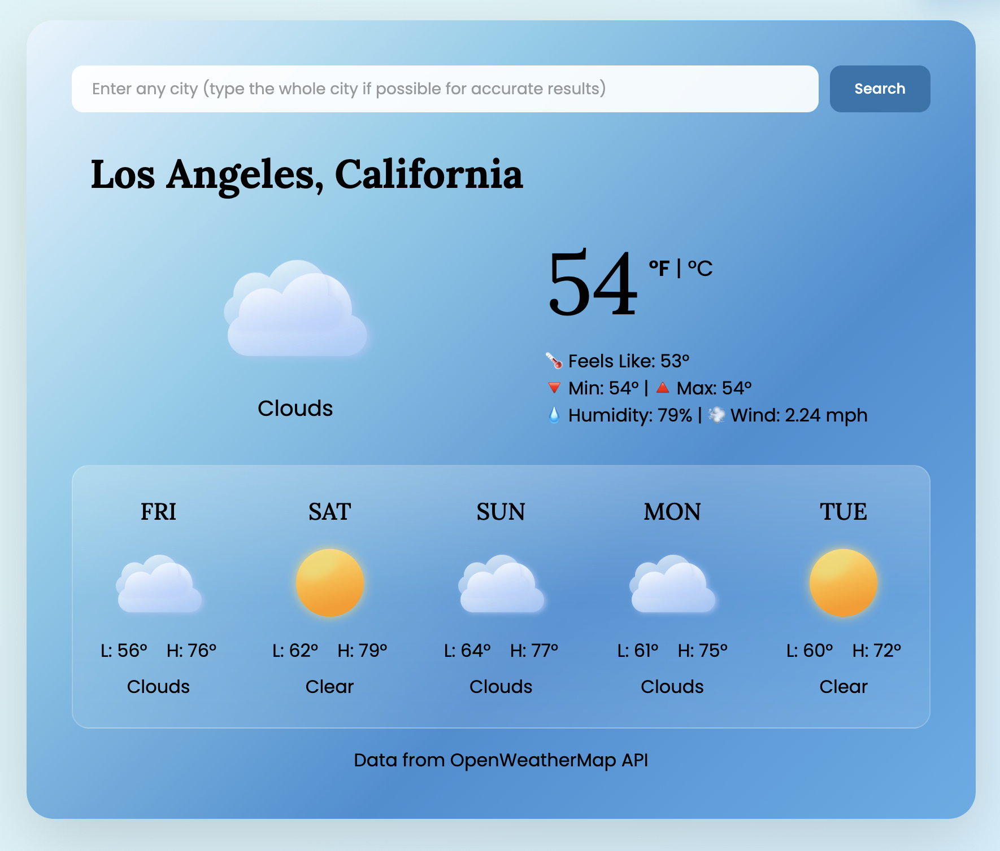
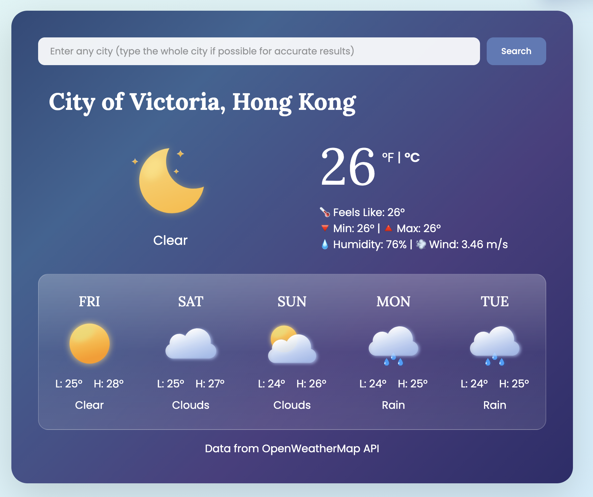

    
    

    
<em>Day and night themes, data fetched around the same time, 10 AM EST</em>

# Weather App
Weather App that uses GeoCoding, Current Conditions, and 5 Day Forecast APIs from OpenWeather to build and deploy a full functioning application that gives data for any location globally. Other features include dynamic themes that can shift based on real sunrise/sunset data, imperial/metric toggling, debounced search that reduces unnecessary API calls and returns accurate results, and error handling with user-facing alerts for failed API requests. This app was built with vanilla JS, no frameworks were used.

## Live Demo
[View Site](https://weather-forecast-global.netlify.app/)

# Technologies
- HTML5
- CSS3
- Vanilla JavaScript (ES6+)
- Netlify (deployment)

# Features
- current conditions and 5 day forecast
- dynamic day and night themes based on the location's sunset and sunrise data
- debounced search using GeoCoding API from OpenWeather
- temperature toggling
- UI feedback for errors

# Process of Creating the Project
- started by using async programming to receive current conditions from API
- connected search terms to API, which brought back longitude and latitude values for the location, that was plugged into a separate API
- another API call was added to get the 5 day forecast, and API calls were parallelized with Promise.all
- The 5 day forecast data was normalized by slicing the response array to always return exactly 5 values, since the number of entries returned by the API varied depending on the time of day
- temperature toggling was added by fetching from the API again and using either imperial or metric units (default is imperial)
- day and night UI themes were added based on location data from the API
- more styling was added to achieve a simple "glass" look for the 5 day forecast

# What I learned
- how to handle multiple API calls within the same application and keep the process of retrieving information fast
- how to influence the UI based on API data 
- how to handle unexpected behavior, data, and errors from an API
- how to create a debounced search with setTimeout() to mimic real search engine behavior

# How it can be Improved
- adding a geolocation feature to automatically get user's location 
- hiding the API key with a backend 